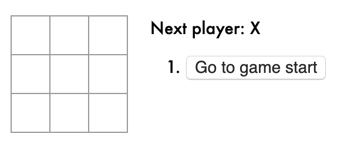
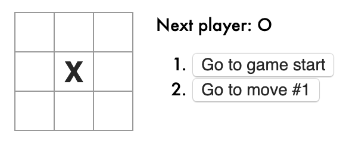
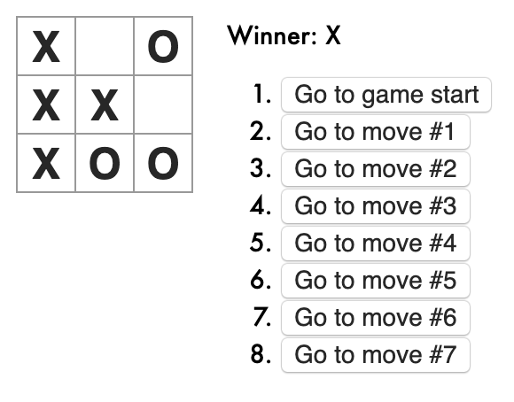

# React Tic-Tac-Toe
An interactive tic-tac-toe game with React.

## Description
This is a standard tic-tac-toe game, but was a good exercise in covering the basics of React. In addition to the gameplay, this app also tracks the winner (signaling when they have won), tracks the history of the moves throughout the game, and gives players the chance to view previous moves of the game. 

Some React principles covered in this app include passing state data through the usage of props, understanding how components interact, and keeping track of state (versions) as immutable so we can go back and visit them later in the game history.

## Application Flow

